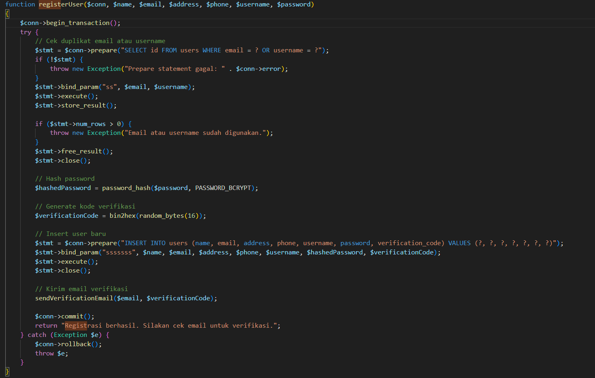
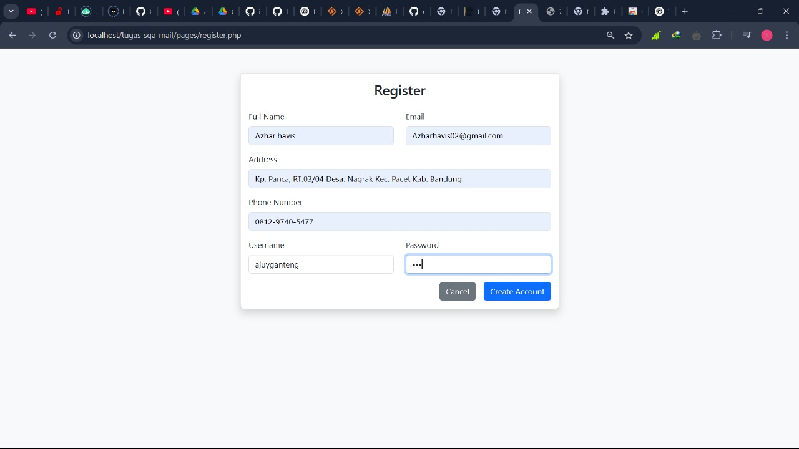
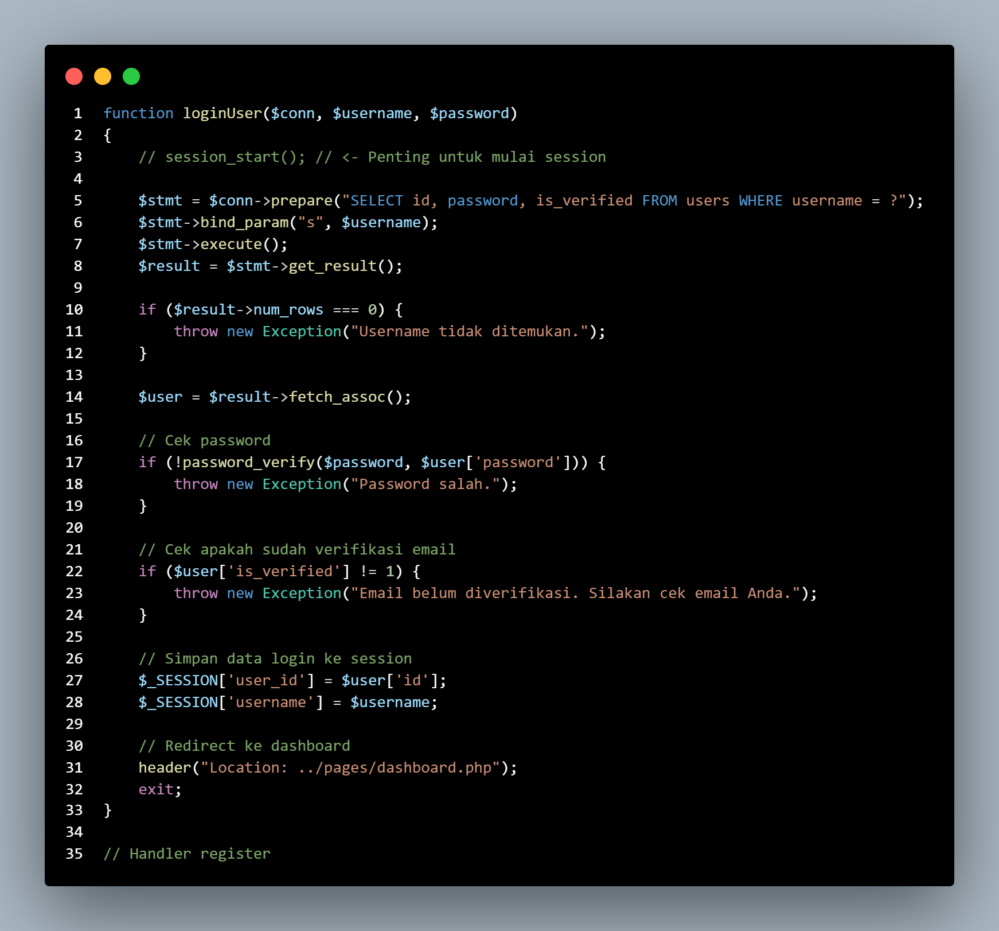
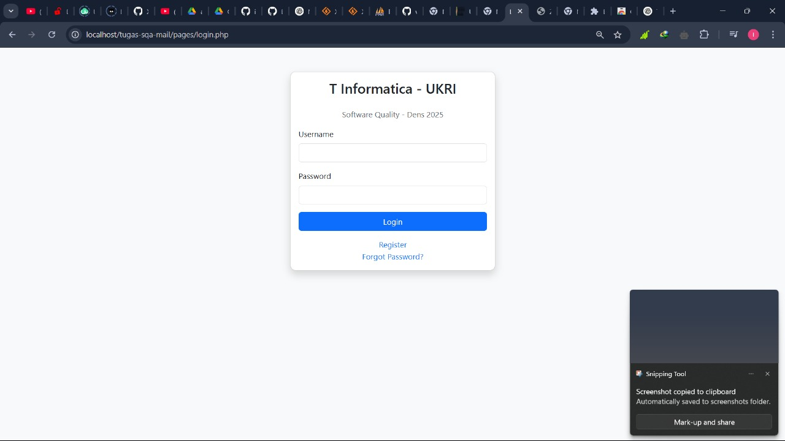
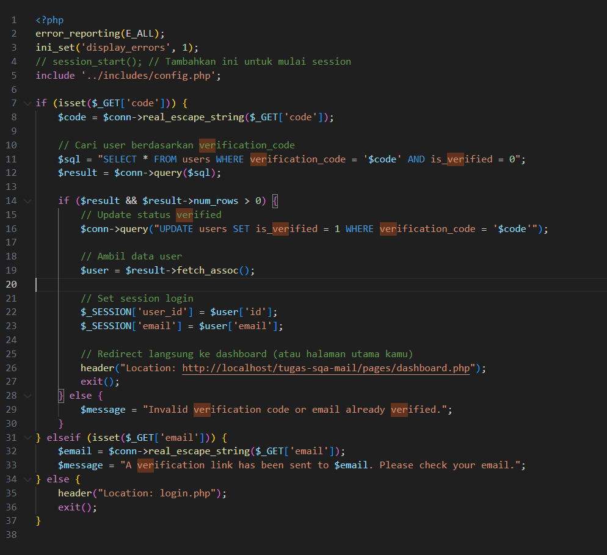
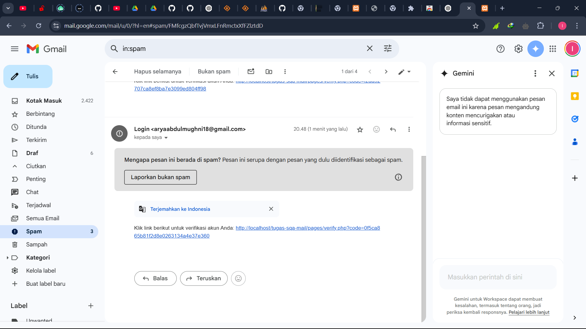
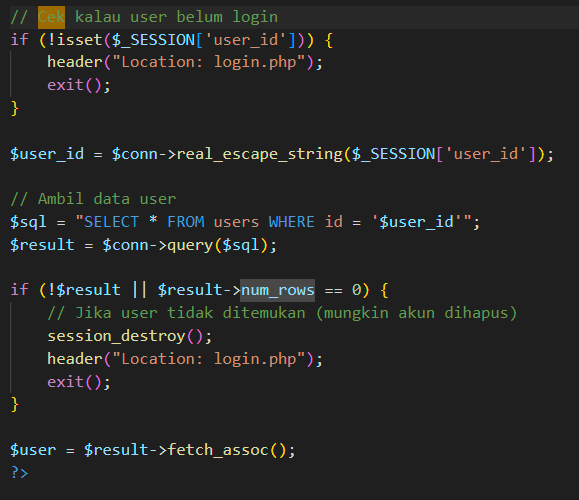
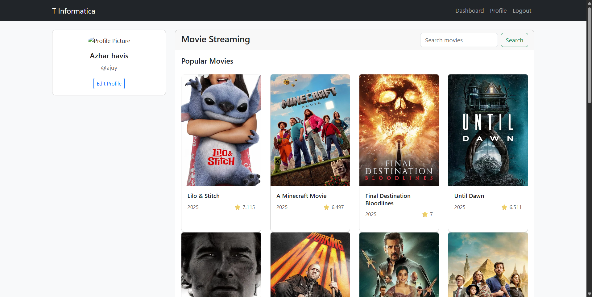

| Bagian      | Komponen                  | Deskripsi Pemeriksaan                                                                 | Hasil Pemeriksaan                                                      | Screenshot Code               | Screenshot Tampilan         |
|-------------|---------------------------|----------------------------------------------------------------------------------------|------------------------------------------------------------------------|-------------------------------|-----------------------------|
| Autentikasi | `register()`              | Input disimpan ke database dengan `generate_password_hash()`                           | ✔️ Password tersimpan dalam bentuk hash                                |            |               |
| Autentikasi | `login()`                 | Password diverifikasi dengan `check_password_hash()`                                   | ✔️ Login berhasil jika password benar                                  |            |               |
| Autentikasi | `sendVerificationEmail()` | Email verifikasi dikirim ke user dengan link berisi kode verifikasi unik               | ✔️ Email verifikasi berhasil dikirim ke alamat user                    |            |          |
| Autentikasi | `dashboard.php`           | Memastikan hanya user yang sudah login dan terverifikasi dapat mengakses dashboard. Data user ditampilkan sesuai `user_id` sesi | ✔️ Hanya user terautentikasi yang dapat mengakses, dan data tampil sesuai user |              |           |
| Autentikasi | reCAPTCHA (gabung) | Validasi captcha dilakukan di sisi klien sebelum submit, dan diverifikasi ulang di server dengan mengirim token ke Google | ✅ Submit dicegah jika checkbox belum dicentang ✅ Server menolak jika token tidak valid atau kosong | JS: grecaptcha.getResponse() PHP: verifikasi token via curl | Pesan error "Please complete captcha" & reload |

