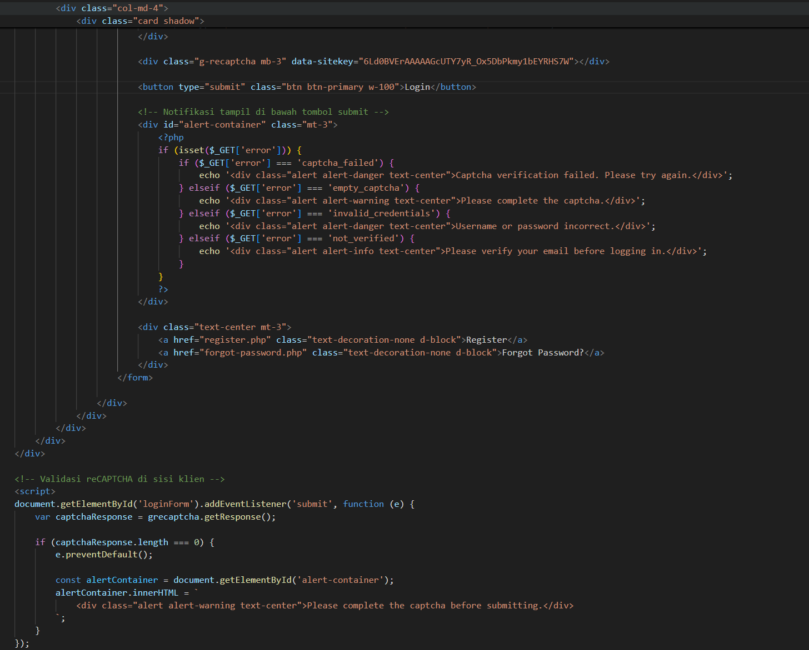

| **Bagian**        | **Komponen**                     | **Deskripsi Pemeriksaan**                                                                                                                                              | **Hasil Pemeriksaan**                                                                 | **Screenshot Code**     | **Screenshot Tampilan**  |
|-------------------|----------------------------------|------------------------------------------------------------------------------------------------------------------------------------------------------------------------|----------------------------------------------------------------------------------------|--------------------------|---------------------------|
| Autentikasi       | `register()`                     | Input disimpan ke database dengan `generate_password_hash()`                                                                                                           | ✔️ Password tersimpan dalam bentuk hash                                               |             |    |
| Autentikasi       | `login()`                        | Password diverifikasi dengan `check_password_hash()`                                                                                                                  | ✔️ Login berhasil jika password benar                                                 |             |                  |
| Reset Password    | `forgotPassword()`               | Mengecek keberadaan email pengguna, membuat token reset, menyimpannya ke database, dan mengirim link reset ke email dengan PHPMailer.                                | ✔️ Token berhasil dibuat dan dikirim ke email yang valid                             |        | |
| Autentikasi       | `sendVerificationEmail()`        | Email verifikasi dikirim ke user dengan link berisi kode verifikasi unik                                                                                               | ✔️ Email verifikasi berhasil dikirim ke alamat user                                  |             |             |
| Bookmark          | `addBookmark()`                  | Menambahkan data bookmark ke dalam tabel `bookmarks`. Data mencakup user, film, judul, dan poster path.                                                               | ✔️ Bookmark berhasil ditambahkan ke database                                          |           | -                         |
| Bookmark          | `removeBookmark()`               | Menghapus data bookmark berdasarkan user dan film tertentu dari tabel `bookmarks`.                                                                                    | ✔️ Bookmark berhasil dihapus dari database                                            | 
       | -                         |
| Bookmark          | `isBookmarked()`                 | Memeriksa apakah film tertentu sudah di-bookmark oleh user. Query dilakukan ke tabel `bookmarks` dengan parameter `user_id` dan `movie_id`. Return `true` jika ada. | ✔️ Fungsi berhasil mengembalikan status bookmark dengan benar                         | 
g         | -                         |
| Bookmark          | `getUserBookmarks()`             | Mengambil seluruh data film yang di-bookmark oleh user. Diurut berdasarkan `created_at`. Jika `poster_path` belum mengandung URL, maka ditambahkan base URL.         | ✔️ Data bookmark tampil lengkap dan urut berdasarkan waktu bookmark                   |      | -                         |
| Halaman utama     | `dashboard()`                    | Memastikan hanya user yang sudah login dan terverifikasi dapat mengakses dashboard. Data user ditampilkan sesuai `user_id` sesi                                      | ✔️ Hanya user terautentikasi yang dapat mengakses, dan data tampil sesuai user        |               |                    |
| Autentikasi       | reCAPTCHA (gabung)               | Validasi captcha dilakukan di sisi klien sebelum submit, dan diverifikasi ulang di server dengan mengirim token ke Google                                            | ✔️ Submit dicegah jika checkbox belum dicentang  ✔️ Server menolak jika token tidak valid atau kosong |          |                 |
